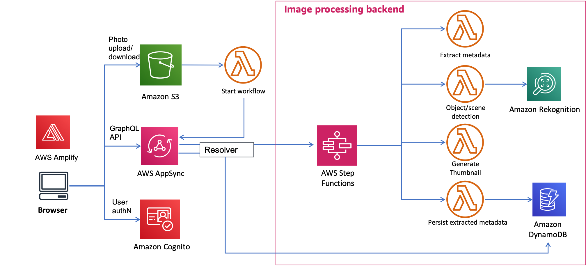

# Serverless Reference Architecture - .NET: Image Recognition and Processing Backend

The Image Recognition and Processing Backend demonstrates how to use [AWS Step Functions](https://aws.amazon.com/step-functions/) to orchestrate a serverless processing workflow using [AWS Lambda](http://aws.amazon.com/lambda/), [Amazon S3](http://aws.amazon.com/s3/), [Amazon DynamoDB](http://aws.amazon.com/dynamodb/) and [Amazon Rekognition](https://aws.amazon.com/rekognition/). This workflow processes photos uploaded to Amazon S3 and extracts metadata from the image such as geolocation, size/format, time, etc. It then uses image recognition to tag objects in the photo. In parallel, it also produces a thumbnail of the photo.

This repository contains .NET5 sample code for all the Lambda functions depicted in the diagram below as well as an AWS CloudFormation template through [AWS CDK](https://aws.amazon.com/cdk/) for creating the functions and related resources. There is also a test web app (coming soon!!) that you can run to interact with the backend.

### Walkthrough of the architecture
1. An image is uploaded to the `PhotoRepo` S3 bucket under the `private/{userid}/uploads` prefix
2. The S3 upload event triggers the `S3Trigger` Lambda function, which kicks off an execution of the `ImageProcStateMachine` in AWS Step Functions, passing in the S3 bucket and object key as input parameters.
3. The `ImageProcStateMachine` has the following sub-steps:
  * Read the file from S3 and extract image metadata (format, EXIF data, size, etc.)
  * Based on output from previous step, validate if the file uploaded is a supported file format (png or jpg). If not, throw `NotSupportedImageType` error and end execution.
  * Store the extracted metadata in the `ImageMetadata` DynamoDB table
  * In parallel, kick off two processes simultaneously: 
     * Call Amazon Rekognition to detect objects in the image file. If detected, store the tags in the `ImageMetadata` DynamoDB table
     * Generate a thumbnail and store it under the `private/{userid}/resized` prefix in the `PhotoRepo` S3 bucket 
